# Cross Platform Project 2
Names:  
Rohith Yanapu WSU ID:A499S235  GitHub ID - #110309836
Prudhvi Reddy Mali WSU ID:Y943Z365  GitHub ID - #90169754
Jithu Project WSU ID:A592S722  GitHub ID - #114536052

COMMITS:  

ROHITH  

1. Commit Description - Math Quiz FlyOuts Added.
    Commit Id - dbb6f60f2ff4c68ef249bc2e2cf3bec6c06d80c0

2. Commit Description - Quiz Interface.  
    Commit Id - c9d81e27fb1df68f66dab93ccd393a8e2865eebd

3. Commit Description - Updated Expression.  
Commit Id - ab8bab5e502d8f416694a4187c103677ede3626a

PRUDHVI  

1. Commit Description - feat: Buttons event handler and checking selection is correct or inco….  
Commit Id -  5916e91a676dc6c059d29cb20158f7cf5c71b1ce

2. Commit Description - feat: Expression Generator.  
Commit Id -  156158d3449d60d04e0659ffe03f3777d7173675

3. Commit Description - feat: 10 Questions in loop, Score card, restart after 10 questions en…
Commit Id - 3fc6d0b692e0d311663bb50c922ee055cb7c7dab

JITENDER  

1. Commit Description - API setup, Data Model, Static JSON Data.  
Commit Id - 21b1ee63c63df650c245daec85609b41eaee5e18

2. Commit Description - Functionality Migration from App to API.  
Commit Id - f3187bd9e1fe622218a7fb668d7e81433710434f

3. Commit Description - Model Creation, Establishing connection with backend.
Commit Id - 7979f5c883256279c7b36ba3f5cb5ed918615374

## YouTube Link
[Demo Video](https://youtu.be/dFifLWx3VZE)

## Application Output Images
### Desktop Images
Desktop Image 1

Desktop Image 2
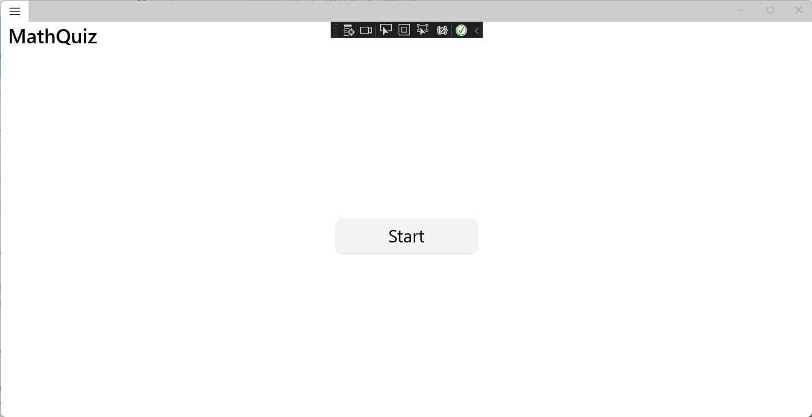
Desktop Image 3
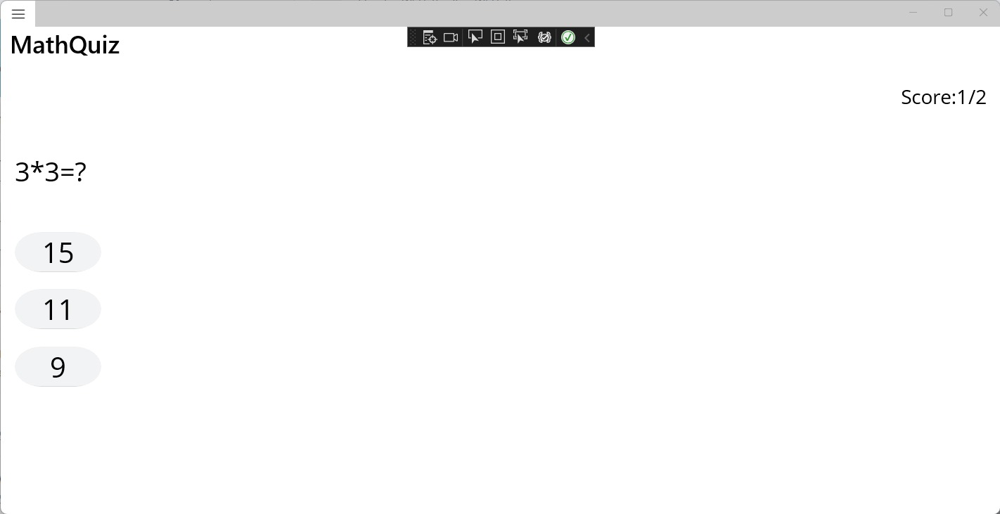
Desktop Image 4
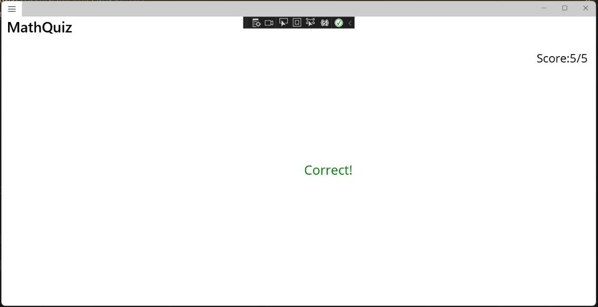
Desktop Image 5
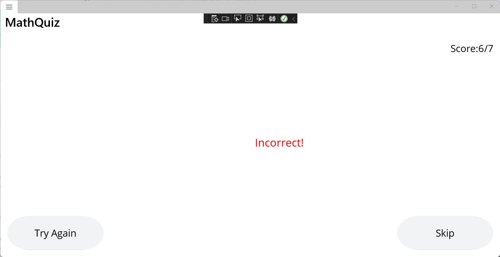
Desktop Image 6
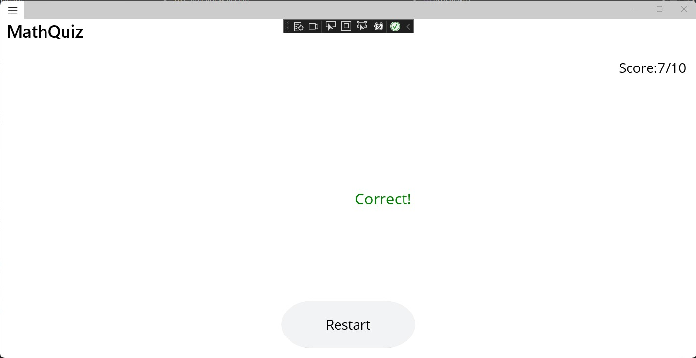

### Andriod Images
Android Image 1
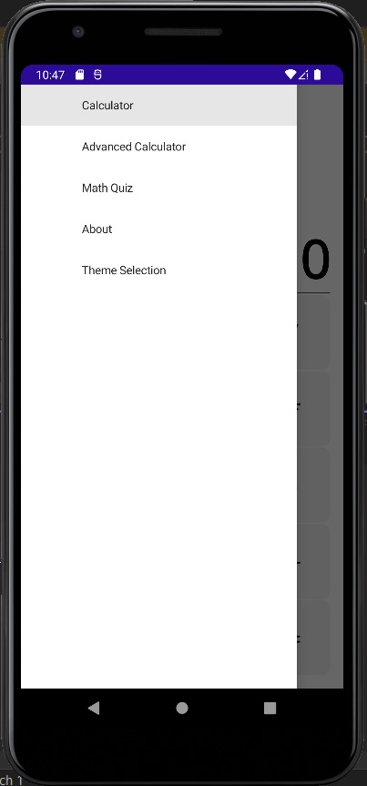

Android Image 2
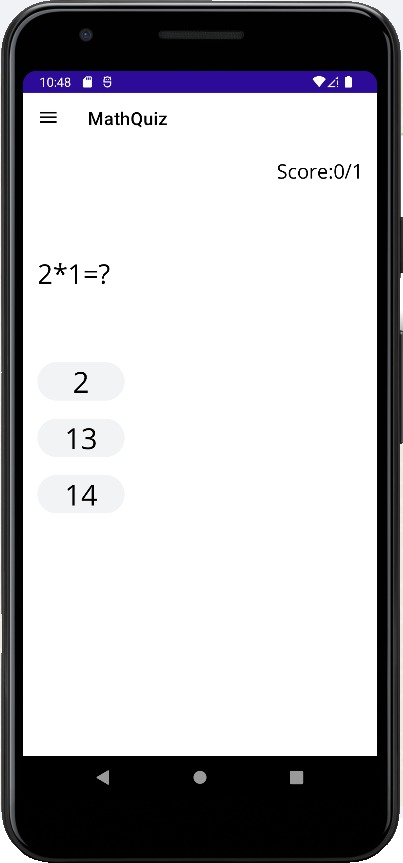

Android Image 3
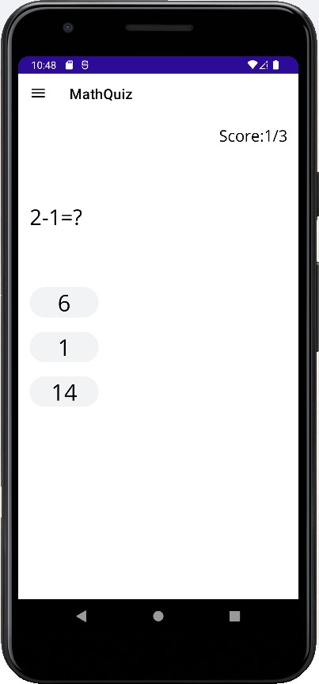

Android Image 4
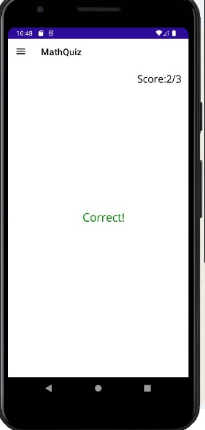

Android Image 5
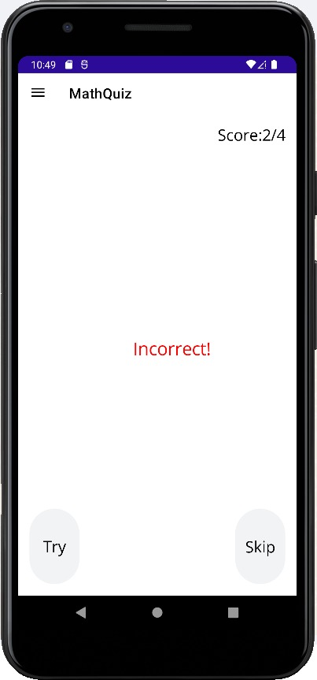

Android Image 6
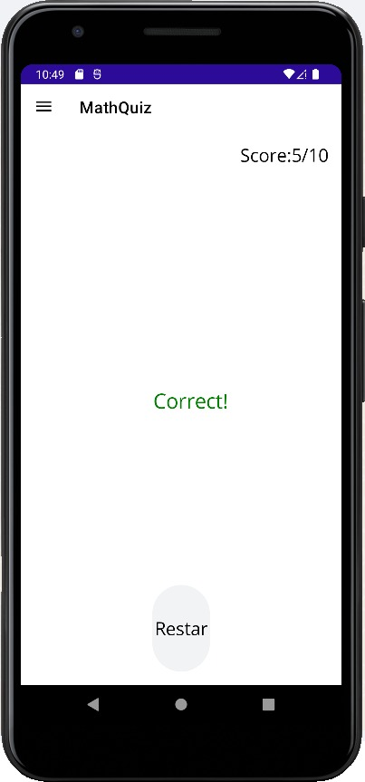
